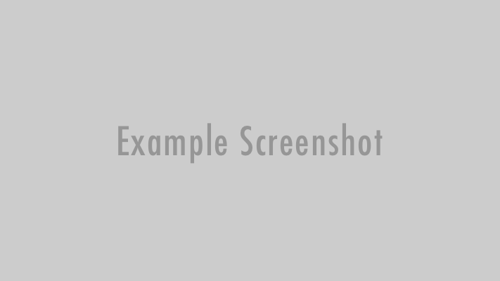

# Theia

***"Titaness of (...) the shining light of the clear blue sky"**
from [Wikipedia](https://en.wikipedia.org/wiki/Theia) retrieved 1 November 2018.*

---

---

Theia is used to control the environment of model (train) layouts based
on real-world data and simulation models. Current development is focused
around lighting 🌄 but we plan to expand the functionalities to include
sound 🔉 and actuator control.

---

---

## 🌱 Origin

This project was started in order to control lighting of model-train
layouts in more interesting ways. Most solutions only offer manual
and rule based control resulting in very predictive behavior. Theia
breaks with this by controlling the model environment based on real-word
data and simulation models that introduce an element of randomness.

## ✅ Principles

-   Science based environment simulation;
-   Simple to start but complex if you want to;
-   Modern user interface;
-   Support for common hardware;

## ✨ Features

Currently Theia is in early development so the list of available features
is a bit short. However we have a lot planned:

-   [x] Accelerated model time
-   [ ] Day and night cycle 🌓
-   [ ] Hardware control over MQTT
-   [ ] Household lighting
-   [ ] Weather patterns 🌀
-   [ ] Traffic 🚗
-   [ ] Opening-hours 🕓
-   [ ] Graphical user interface
-   [ ] Moon and stars 🌛✨
-   [ ] DCC train control 🚂
-   [ ] Weather sounds 🔉

## 🤔 Getting started

Currently there is not much use in this project as an end user. However
if you would like to contribute head over to the
[contributing](https://mikevansighem.github.io/theia/contibuting) section
of our documentation. We are happy to receive pull-requests.

## 📚 Documentation

All our documentation including on how to get started can be found
[here](https://mikevansighem.github.io/theia).

## 📃 License

Theia is created by Mike van Sighem and licensed under LGPL version 3.
Refer to the
[license](https://github.com/mikevansighem/theia/blob/master/docs/LICENSE.md)
for more details.

## 💛 Contributing 

We are happy to see contributors on the project. Head over to the
[contributing](https://mikevansighem.github.io/theia/contibuting) section
of our documentation and submit your first pull-requests.
